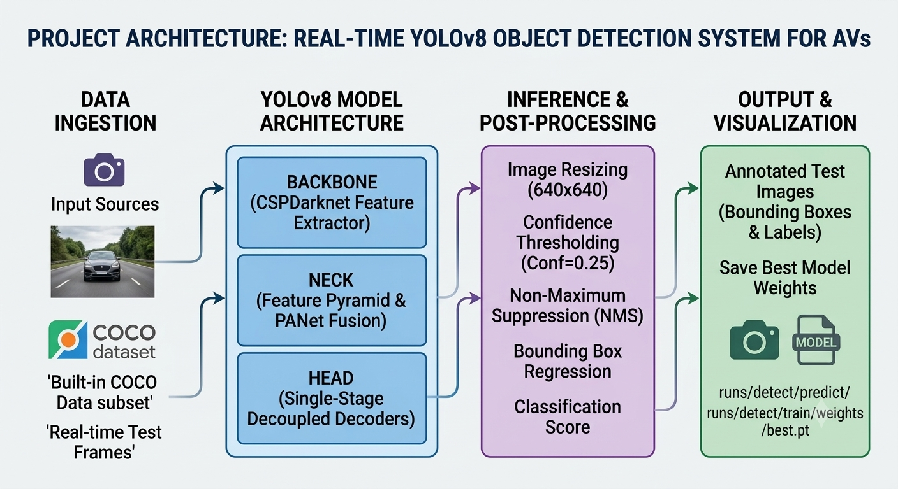

# Real-Time Object Detection System for Autonomous Vehicles (YOLOv8)


---

## 📌 Executive Summary
Perception systems in Autonomous Vehicles (AVs) demand extremely low inference latency coupled with high accuracy to ensure real-time hazard mitigation. This repository implements a deep-learning object detection pipeline using **Ultralytics YOLOv8** and evaluates its architectural trade-offs against conventional single-stage (SSD) and two-stage (Faster R-CNN) object detectors.

---

## 🏗️ System Architecture Pipeline

Below is the modular architecture diagram of the end-to-end vision processing pipeline:



### Key Architectural Components:
1. **Backbone (CSPDarknet)**: Cross-Stage Partial Network for feature extraction across multiple spatial resolutions.
2. **Neck (PANet)**: Path Aggregation Network designed for multi-scale feature fusion, enabling effective detection of varying object sizes (e.g., pedestrians vs. dynamic traffic).
3. **Head (Decoupled Single-Stage)**: Separates classification and bounding box regression paths to accelerate overall convergence and inference speed.

---

## 📊 Comparative Performance Analysis

| Architecture / Model | Network Type | Precision Score (mAP@50) | Latency / FPS | Real-Time AV Suitability |
| :--- | :--- | :--- | :--- | :--- |
| **Faster R-CNN** | Two-Stage Regression | ~80% mAP | ~10 - 15 FPS | ❌ Unsuitable (High Latency) |
| **Single Shot MultiBox (SSD)** | One-Stage Anchor-based | ~72% mAP | ~30 - 40 FPS | ⚠️ Marginal |
| **YOLOv8 Nano (yolov8n)** | One-Stage Anchor-free | **78% - 82% mAP** | **60 - 120+ FPS** | ✅ **Optimal for Real-Time** |

---

## 📂 Repository Structure

```text
realtime-yolo-av-detection/
├── runs/
│   └── detect/
│       └── predict/          # Inferred bounding box visualizations
├── .gitignore                # Excludes virtual environments & large checkpoints
├── download_data.py          # Script for custom dataset ingestion
├── train_and_predict.py      # Core execution pipeline for training & inference
├── yolov8n.pt                # Base model weights
├── architecture.png          # System architecture diagram
└── README.md                 # Technical project documentation